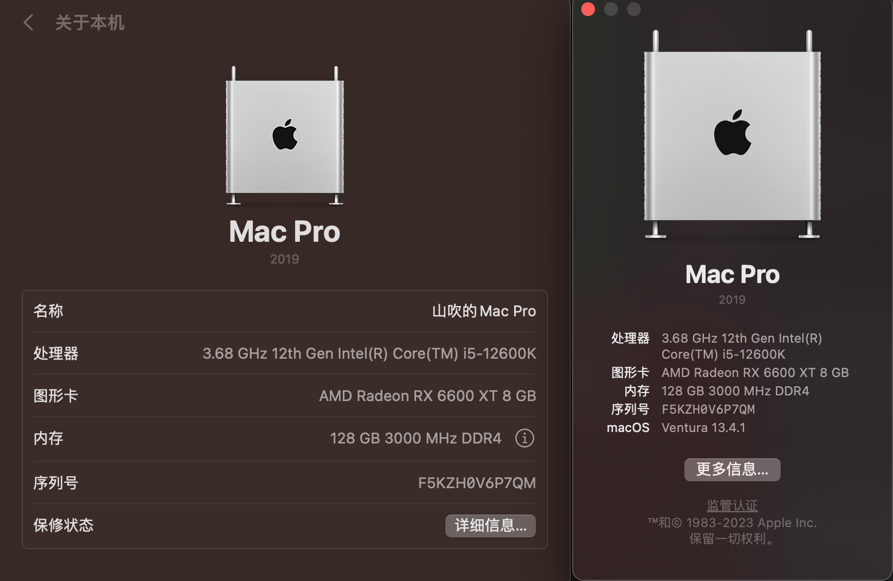

# Hackintosh-12th-Gen-Intel-Core-MAXSUN-B660M-MS-TERMINATOR

## 已知问题
apple妙控键盘 会出现打字自动多次按键

apple妙控触摸板 长时间拖动会出现延迟

不知道是否是蓝牙引起，后面测试intel网卡在测试下intel蓝牙有没有问题

#
适用于 12代intel + 铭瑄B660M终结者 DDR4 黑苹果引导文件

基于 OpenCore 0.9.3 版本，机型 MacPro 7,1，系统 MacOS 13.4.1

ACHI usb定制

# 本机配置

| 配置        | 型号                      |
|-----------|-------------------------|
| CPU       | intel i5 12600K         |
| 主板        | 铭瑄 b660m 终结者            |
| 显卡        | 6600xt 8g               |
| 内存        | 光威 3000mhz 32G * 2      |
| SSD       | 三星 pm9a1                |
| WiFi + 蓝牙 | BCM94360CD (PCI+USB转接卡) |

# 使用情况

# BIOS 配置
### 禁用：
重置bios后，无需调整

### 开启：
xmp按需调整

vmx按需开启

启动方式改为 其他操作系统启动

# 等待添加
intel网卡支持

# 注意
12600以下的cpu不带小核的，在 kernel停用CpuTopologyRebuild.kext 同时 Quirks取消勾选ProvideCurrenCpuInfo
，NVRAM中boot-args 去除-ctrsmt

内存条降价了，又重新买了机器弄上了黑苹果